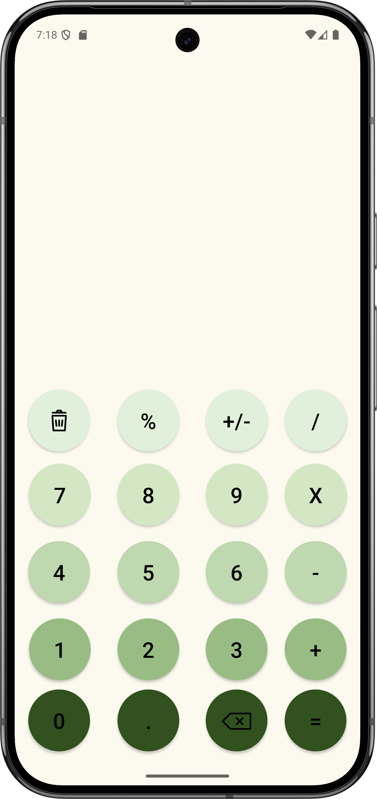

# Modern Calculator

A modern calculator app developed in **Kotlin** using **Android Studio**. The app features a sleek and user-friendly design with a **green color palette**, creating a fresh and inviting user experience.

---

## Features
- Clean and modern UI design.
- Accurate calculations with smooth interactions.
- Built with Kotlin for high performance and cross-platform compatibility.

---

## Screenshots
Here are some screenshots of the app:

### Main Screen

### Calculation Example

